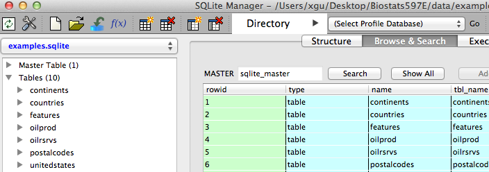
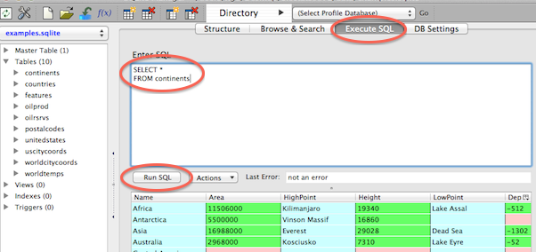
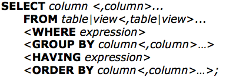

## What Is SQL

- Structured Query Language (SQL) is a standardized, widely used language that retrieves and updates data in relational tables and databases.
- SQL is part of many vendors' products and SQL is everywhere
- Example of open source SQL databases: MySQL, PostgreSQL, SQLite
- SAS also comes with **PROC SQL** to run SQL statement for data processing
- In big data world like Hadoop, SQL like language is also created such as **HIVE** and **PIG** to easily retrive data

## SQL Basics

- **Database**: a collection of data stored in some organized fashion. For SQLite data base, it is a file usually with **.sqlite** extension.
- **Tables**: a structured file that can store data of specific type
- **Column**: a single field in a table
- **Rows**: a record in a table
- **Primary key**: a column whose values uniquely identify every row in a table

## How to Query SQL Database

- Connect to database (varies with different products)
- Run SQL query and return results (very similiar for all databases and is our focus for this class)
- Disconnect from database

## Why SQLite

- Widely used (e.g. iphone app)
- Easy to install and use, the database is just a file
- Minimal configuration needed
- Can be accessed by many programming languages such as R, Python
- Our focus is to learn how to write SQL query, which is similar for different products

## Install SQLite Manager in Firefox

We can learn SQLite using Firefox's SQLite Manger add-on:

- Download and Install Firefox from <http://www.firefox.com>
- Firefox: click **Tools >> Add-ons** to open Add-ons manager
- Search **SQLite** and find **SQLite Manager** to install
- Restart Firefox and click **Tools >> SQLite Manager** to open SQLite Manager

## Connect to Database
- The SQLite database is a file with extension **.sqlite**
- Download the course material, and find **data/examples.sqlite** file
- In **SQLite Manager** click **Database >> Connect Database** and select the **examples.sqlite** file
- We should be able to see tables in the database and browse data in each table


## Run SQL Query

- Click **Execute SQL Tab**
- Enter SQL query
- Click **Run SQL**



## SQLite in R
We can also connect to SQLite database using R. The R package we need to use is **RSQLite**

```{r, eval=F}
install.packages("RSQLite")
```
Commonly used functions:

- **dbConnect**: Connect to a database
- **dbListTables**: List tables in the database
- **dbListFields**: List fieldes of a table in the database
- **dbGetQuery**: Send a query and receive results
- **dbDisconnect**: Disconnect from a database

## RSQLite Example

Connect to database, i.e. examples.sqlite
```{r, message=FALSE}
library(RSQLite)
con <- dbConnect(RSQLite::SQLite(), "../data/examples.sqlite")
```

List tables in the database
```{r}
dbListTables(con)
```

## RSQLite Example
Send query to get name and area form continents table
```{r}
dbGetQuery(con, "SELECT name, area FROM continents")
```

## Tables In examples Database
- **countries**: data that pertains to countries.
- **worldcitycoords**: latitude and longitude data for world cities
- **uscitycoords**: coordinates for cities in the United States
- **unitedstates**: data that is associated with the states
- **postalcodes**: postal code abbreviations
- **worldtemps**: average high and low temperatures from various international cities
- **oilprod**: oil production statistics from oil-producing countries
- **oilrsrvs**: approximate oil reserves of oil-producing countries
- **continents**: geographic data that relates to world continents
- **features**: statistics that describe various types of geographical features, such as oceans, lakes, and mountains

## Retrieving Data from a Single Table

General form of SQL statement for a query:



- **SELECT**: specifies the columns to be selected
- **FROM**: specifies the table to be queried
- **WHERE**: subsets the data based on a condition
- **GROUP BY** classifies the data into groups
- **HAVING**: subsets groups of data based on group condition
- **ORDER BY**: sorts rows by the values of specific columns

**NOTE: SQL queries are case insensitive**

## Selecting Specific Columns in a Table
To select a specific column in a table, list the name of the column in the SELECT clause.

```
select City
  from uscitycoords;
```

Multiple columns separated by ","
```
select City, State
  from uscitycoords;
```

"*" is used to represent all columns
```
select *
  from uscitycoords;
```

## Eliminating Duplicate Rows

You can eliminate the duplicate rows from the results by using the **DISTINCT** keyword in the SELECT clause.

Compare
```
select Continent
  from unitedstates;
```

and

```
select distinct Continent
  from unitedstates;
```

## Creating New Values and New Columns

You can use **as** to assign a new name to any column selected.
```
select City as us_city, 
       State as us_state
  from uscitycoords;
```

You can perform calculations with values that you retrieve from numeric columns and save a new column. 

Convert Fahrenheit to Celsius for temperature
```
select City,
       (AvgLow - 32) * 5/9 as LowCelsius
  from worldtemps;
```

## Assigning Values Conditionally

**CASE** expressions enable you to interpret and change some or all of the data values in a column to make the data more useful or meaningful.

```
select City, Country, Latitude,
    case
        when Latitude gt 67 then 'North Frigid'
        when 67 ge Latitude ge 23 then 'North Temperate' 
        when 23 gt Latitude gt -23 then 'Torrid'
        when -23 ge Latitude ge -67 then 'South Temperate' 
        else 'South Frigid'
    end as ClimateZone
from worldcitycoords;
```

## Replace Missing Values
Replace missing **Area** with 0 in continents data
```
select Name,
      case 
        when Area is null then 0
        else Area
      end as Area
  from continents;
```

## Sorting Data
You can sort query results with an **ORDER BY** clause by specifying any of the columns in the table, including columns that are not selected or columns that are calculated.

```
select Name, Population
  from countries 
  order by Population;
```

Multiple column names in **ORDER BY** separated by **,**. Specify **DESC** for descending order a column.

```
select Name, Continent
  from countries
  order by Continent desc, Name;
```

## Other Notes About Sorting

- You can sort by a calculated column by specifying its alias in the ORDER BY clause
- You can sort query results by columns that are not included in the query
- Nulls, or missing values are sorted before character or numeric data

## Retrieving Rows Satisfying a Condition
The **WHERE** clause enables you to retrieve only rows from a table that satisfy a condition.

```
select Name, Population
  from countries
  where Continent = 'Europe';
```

```
select Name, Population
  from countries
  where population > 1e8
```

## Comparisons
Symbol            Definition
-------------   --------------
=                 equal to
!=, <>                not euql to
>                 gretaer than
<                 less than
>=                greather than or equal to
<=                less than or equal to

## Retrieving Rows Satisfying Multiple Conditions

You can use logical, or Boolean, operators to construct a **WHERE** clause that contains two or more expressions.

Logical operators

- &, AND
- |, OR
- NOT

```
select Name, Population
  from countries
  where Continent = 'Africa' and Population > 20000000 
  order by Population desc
```
## IN Operator
The **IN** operator enables you to include values within a list that you supply

```
select Name, Type, Height
  from features
  where Type in ('Mountain', 'Waterfall') 
  order by Height;
```

or use **NOT IN**

```
select Name, Type, Height
  from features
  where Type not in ('Mountain', 'Waterfall') 
  order by Height;
```

## BETWEEN-AND Operator
To select rows based on a range of values, you can use the **BETWEEN-AND** operators.

```
select City, Country, Latitude
  from worldcitycoords
  where Latitude between -5 and 5;
```

