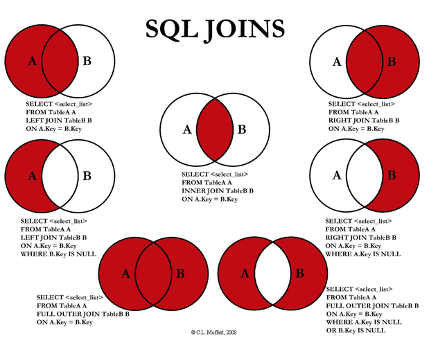

## SQL Joins

- Using **WHERE** with list of tables generate only records with matches.
- What if we want to keep those unmatched records?
* Here, we introduce SQL joins:
    + **INNER JOIN**: Returns all rows when there is at least one match in BOTH tables
      (same as using **WHERE**)
    + **LEFT JOIN**: Return all rows from the left table, and the matched rows from the right table
    + **RIGHT JOIN**: Return all rows from the right table, and the matched rows from the left table
    + **FULL JOIN**: Return all rows when there is a match in ONE of the tables
* Joins use **ON** clause to specify conditions
    
## Inner Join
The INNER JOIN keyword selects all rows from both tables as long as there is a match between the columns in both tables.


- Example: Find coordinates of country capitals
```
select Name, Capital, Latitude, Longitude
  from countries a inner join worldcitycoords b
  on a.Capital = b.City and a.name = b.Country
```
- You do not need a.Capital if column name Capital appears in only table a
- You can also achieve this using **WHERE** 

## Left Join
The LEFT JOIN keyword returns all rows from the left table (table1), with the matching rows in the right table (table2). The result is NULL in the right side when there is no match.


- Example: Find coordinates of country capitals, also list capitals without matched coordinates

```
select Name, Capital, Latitude, Longitude
  from countries a left join worldcitycoords b
  on a.Capital = b.City and a.name = b.Country
```

## Right Join
The RIGHT JOIN keyword returns all rows from the right table (table2), with the matching rows in the left table (table1). The result is NULL in the left side when there is no match.


- Right join is not implemented in SQLite
- Right join is available in other SQL system such as SAS
- Right join is less often used
- You can achieve right join using left join (how?)

## Full Join

The FULL OUTER JOIN keyword returns all rows from the left table (table1) and from the right table (table2).
The FULL OUTER JOIN keyword combines the result of both LEFT and RIGHT joins.


- Full join is not implemented in SQLite
- Full join is available in other database system such as SAS
- Full join is rarely used in my experience

## Summary



## Excercise

- Using **oilprod** and **oilrsrvs** to find countries that have oil production but do not have oil reserve

```
select t1.country
from oilprod t1 left join oilrsrvs t2
on t1.country = t2.country
where t2.country is null
```


## Combine Join and Sub-query

- Many data retrieving tasks can be achieve by combining joins and sub-queries
- Example: For each country, find what proportion of its population over the total population of its corresponding continent

```
select a.Name, a.continent, 
       a.population / b.total_population as percentage
  from countries a inner join
       (select Continent, sum(population) as total_population
          from countries group by Continent) b
    on a.Continent = b.Continent
```

## Multiple Joins

Problem: Find **coordinates** of **African** cities with **oil reserves**

- Use sub-queries
```
select * from worldcitycoords
  where country in
     (select Country from oilrsrvs
        where Country in
          (select name from countries where Continent = 'Africa'))
```

- Use joins
```
select t1.*
  from worldcitycoords t1 inner join
    oilrsrvs t2 on t1.country = t2.country
    inner join countries t3 on t2.country = t3.name
    where t3.Continent = 'Africa'
```

## Combine Tables Vertically

- Joins combine tables horizontally expanding columns
- We can also combine tables with similar structures (same names, similar data types) vertically to expand rows, similar to **rbind** function in R
- We use **UNION** to achieve this

```
SELECT column_name(s) FROM table1
UNION (ALL)
SELECT column_name(s) FROM table2
```

- **UNION** selects only distinct values after combining
- If we want to keep the duplicate records, we use **UNION ALL**
- Columns in two tables should have same number of columns in same order with similar data type

## UNION Example

- Find countries with oil production or oil reserve
```
SELECT country from oilprod
UNION
SELECT country  from oilrsrvs
```

```
SELECT country from oilprod
UNION ALL
SELECT country  from oilrsrvs
```
