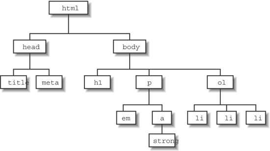

## Web Scraping

How to web scraping?

- Read a webpage as a HTML document
- Parse and extract interested elements of the document, such as table, image link
- Further process the parsed data ready for analysis

Tools in R for web scraping

- R package **rvest** is very useful and easy to use, which we will use for the class

## HTML Document

Each webpage is a HTML document, which is a text document. In Chrome, 

Go to webpage >> **view** >> **developer** >> **View Source**

```
<!DOCTYPE html>
<html>
  <head>
    <title>Page Title</title>
  </head>
  <body>
    <h1>This is a Heading</h1>
    <p>This is a paragraph.</p>
  </body>
</html>
```

## HTML Document Structure
HTML document has a tree structure containing nodes.

</img>

Reference: <a>http://flylib.com/books/en/4.439.1.131/1/</a>

## HTML Element
```<tagname attributes>content</tagname>```

- tagname are **a**(link), **p** (paragraph), **img** (image) etc
- attributes are **class**, **id**, etc

```
<p>My first paragraph.</p>

<a href="http://www.w3schools.com">This is a link</a>


<p>This is some <span class="note">important</span> text.</p>

<div id="hello">
  h3("Hello World")
</div>
```

## R Package ```rvest``` Functions

1. Read a web page: ```read_html()``` function
2. Select intersted element or nodes: ```html_nodes()``` function
3. Extract node attributes or content
  - Extract text: ```html_text()``` function
  - Extract attributes such as image source or link address: ```html_attrs()``` function
  
If we want to extract table in the nodes, we can use ```html_table()``` functions

## Read a Webpage

```
umass <- read_html("http://www.umass.edu")
```

```
lego_movie <- read_html("http://www.imdb.com/title/tt1490017/")
```

## CSS Selector to Select Nodes

```
<div class="myimage">
  <a href="image.png" id="img">This is my image</a>
  <p> Hi </p>
</div>
```

- Select by id preceding by **#**, e.g. "#img"
- Select by tag name, e.g. "p" or "div"
- Select class preceding by **.**, e.g. ".myimage"

"div #img" means nodes with id of "img" inside a "div" tag

<a href="http://www.w3schools.com/cssref/css_selectors.asp"> For more details </a>

## UMASS News

```
library(dplyr)
# All news nodes
news <- html_nodes(umass, ".homepage-news-item")

# check structure of each news item
xml_structure(news[[1]])

# print out the node
cat(as.character(news[[1]]))

# All news titles
news_titles <- html_nodes(news, ".homepage-news-title") %>%
  html_text()

# All news links
html_attr(news, name = "href")
```

## Selectorgadget

Selectorgadget is a javascript bookmarklet that allows you to interactively figure out what css selector you need to extract desired components from a page.

<a href="https://cran.r-project.org/web/packages/rvest/vignettes/selectorgadget.html">
See the reference </a>


## Lego Movie

```
lego <- read_html("http://www.imdb.com/title/tt1490017/")

# get cast - use Selectorgadget to find selector
cast <- html_nodes(lego, "#titleCast .itemprop") 
cast <- html_nodes(cast, "span") %>% html_text()

# get the review - use Selectorgadget to find selector
review <- lego %>% html_nodes("strong span") %>% html_text()

```

## Wikipedia - Country Population

```
country_pop <- read_html("https://simple.wikipedia.org/wiki/List_of_countries_by_population")

pop_table <- html_table(country_pop, fill = TRUE)[[2]]

# some cleaning
pop_table[, 2] <- gsub("\\[.+\\]", "", pop_table[, 2])
pop_table[, 3] <- gsub(",", "", pop_table[, 3])
pop_table[, 3] <- gsub(" million", "e6", pop_table[, 3])
pop_table[, 3] <- gsub(" billion", "e9", pop_table[, 3])
pop_table[, 3] <- as.numeric(pop_table[, 3])
```
