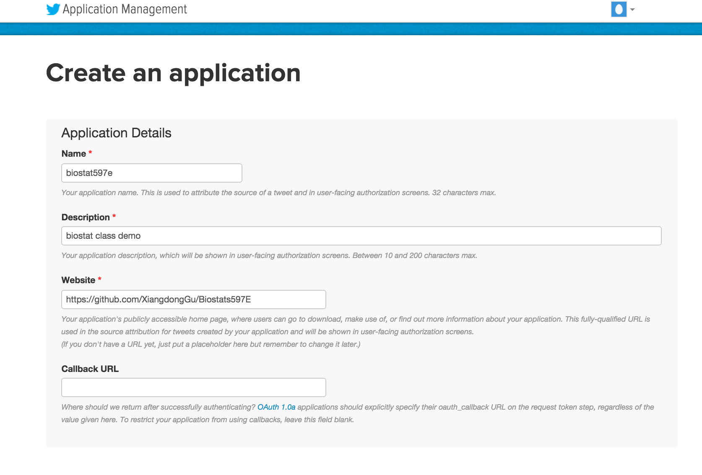
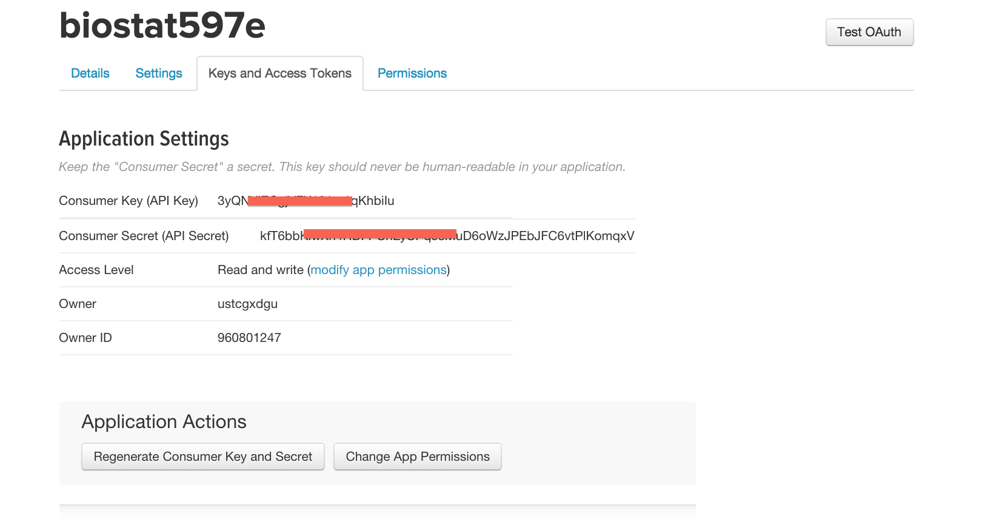

## Web Request

Web request method:

- **GET**: Requests data from a specified resource. It is what you use when visiting a webpage (focus more on this method)
- **POST** Submits data to be processed to a specified resource. For example, registering new user.

## Web API

- Using web request to obtain data
- It provides nice and convinient interface
- It usually return well structured data in JSON or XML format
- The data is much easier to process

**Example**: http://freegeoip.net

```
library(httr)
res <- GET("http://freegeoip.net/csv/50.78.253.58")
content(res, "text")
```

## Authentication

Some web APIs do not use authentication, so anyone can make API call for free.

Some APIs require authentication, such as Twitter, to charge money or limit usage.


## Obtain Twitter Authentication

- Register Twitter account
- Go to https://apps.twitter.com 
- Create a New App and fill the information

</img>

## Obtain Twitter Authentication

- Go to "Keys and Access" tab to obtain the API key and API secret
- Also create access token

</img>

## User TwitteR Package

see Twitter.R for example

## Job Search API Using indeed.com

indeed.com provides easy to use API to do your job search without scraping the page

First, we need obtain authentication

- Go to http://www.indeed.com/publisher
- Create an publisher account
- Log in account and go to 'XML Feed' to see your publisher id


See indeed.R for example


